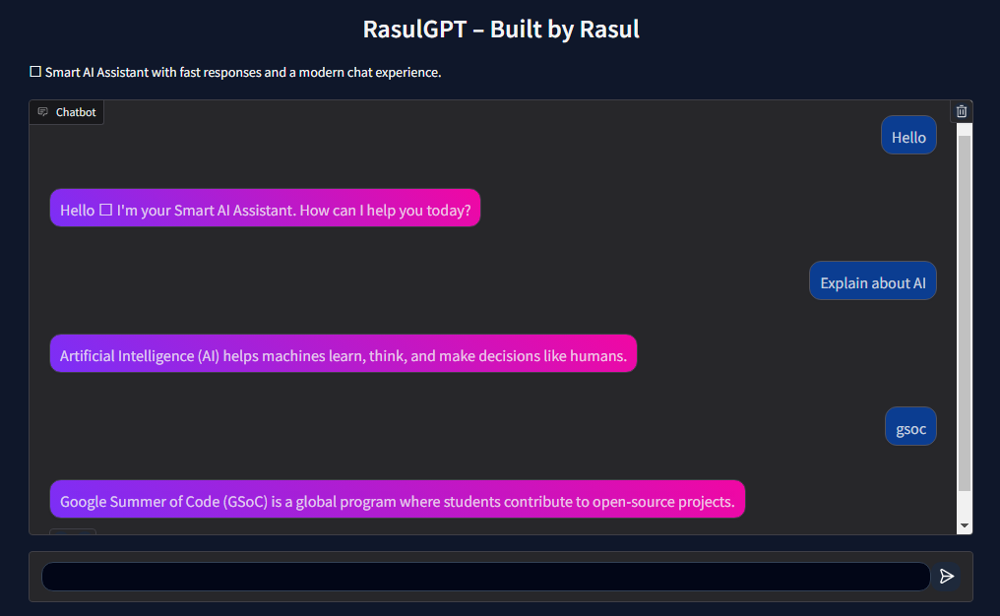

# rasul-gpt-assistant

An intelligent AI chatbot with modern interface, fast performance, and user-friendly design.

This chatbot is a user-friendly and gives good accuracy results.

Project Overview:-

rasul-gpt-assistant is an AI-powered conversational assistant designed to provide intelligent responses, task automation, and context-aware interactions using modern natural language processing techniques. The project focuses on building a scalable, modular, and production-ready assistant that can be extended for multiple real-world applications.

The system is designed with clean architecture principles, efficient response handling, and customizable components to support research, development, and open-source collaboration.

This project aims to demonstrate strong software engineering practices, AI integration, and maintainable system design suitable for large-scale open-source programs such as Google Summer of Code.

Objectives:-

*Build a reliable conversational AI assistant

*Implement modular and extensible system architecture

*Provide real-time intelligent response generation

*Support easy customization and integration

*Maintain clean and production-level code structure

*Enable future research and feature expansion

Key Features:-

//Conversational Intelligence

*Context-aware response generation

*Natural language understanding

*Dynamic user interaction handling

*Structured conversation flow management

//Modular Architecture

*Clean and scalable project structure

*Separated components for maintainability

*Easy feature extension

*Independent module testing support

//AI Integration

*Language model-based processing

*Intelligent query handling

*Adaptive response generation

*Efficient input processing pipeline

//Performance Optimization

*Fast response processing

*Efficient resource usage

*Lightweight execution design

//Developer Friendly Design

*Clear documentation

*Simple configuration setup

*Open-source ready structure

*Easy deployment workflow

//System Architecture

The project follows a modular architecture consisting of:-

*Input Processing Layer — handles user queries and preprocessing

*AI Processing Engine — generates intelligent responses

*Response Handler — formats and delivers output

*Configuration Module — manages system settings

This design ensures maintainability, scalability, and flexibility for future improvements.

//Technology Stack

:-Python

:-Natural Language Processing

:-Machine Learning Concepts

:-REST/API Integration (its for optional extensions)

:-Modular Software Design Principles

Installation:--

//Clone the repository:

git clone https://github.com/yourusername/rasul-gpt-assistant.git
cd rasul-gpt-assistant

//Install dependencies:

pip install -r requirements.txt

//Run the project:

python main.py

Project Structure:--

rasul-gpt-assistant//

│

├──> src/

├──> modules/

├──> config/

├──> tests/

├──> requirements.txt

└──> main.py

The structure is designed for clarity, scalability, and ease of contribution.

//Use Cases of this project..

*Intelligent virtual assistant systems

*Research in conversational AI

*Automation tools

*AI-based applications

*Educational and experimental NLP systems

//Future Improvements:--

*Memory-based conversation support

*Web interface integration

*Multi-language support

*Performance optimization

*Plugin system for extensions

*API service deployment

//Contribution:--

Contributions, suggestions, and improvements are welcome.
Please follow standard open-source contribution practices.

//License:--

This project is licensed under the MIT License.

## Output Screenshots

### Desktop View

### Mobile View

